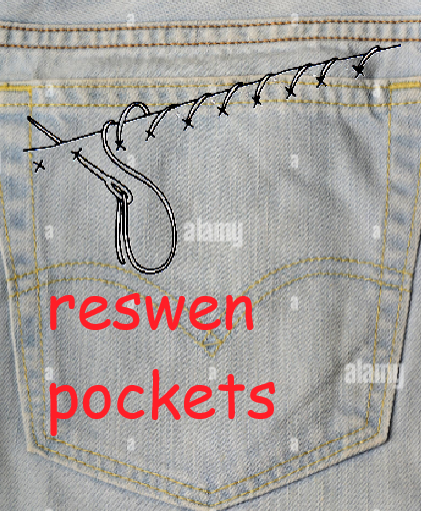

  
<small>Mod Icon for Resewn Pockets, made in MS Paint in a whopping thirty seconds of hard work  

Resewn Pockets
===

Resewn Pockets is a Fabric mod requested by a user on Discord and made by GauntRecluse. It is currently in early development.  

## What is this?  
This mod's main feature and focus is creating a serverside system which can add custom conditions for items picking up
items and taking items from chests and other containers or inventories.  
This allows server owners/admins or modpack creators and the like to more precisely manage limitations on
a player's inventory space on Fabric servers or modpacks with some level of pre-chewed work.  
It is currently only intended for Fabric 1.21.1, but may be ported to other versions in the future.

## How does it work?  
The mod uses Mixins, a set of tools to modify code external to your mode during the game launching and loading (oversimplifying),
to edit the code that checks for whether a player can pick up/hold an item or not, and adds a check for this mod's logic.  
Then, it uses a configuration system and allows other mods to modify it via Mixins to allow to feed custom logic to those checks. In short:  
Config + External Mixins -Custom Logic-> ResewnPockets -> Mixins -> Minecraft Vanilla checks  

## Where documentation? Where downloads? How config?  
Currently, the config system is in development, and so is the rest of the mod. It is, as such, unavailable for download or installation.  
As such, the following are the _planned_ installation methods, but are _subject_ to change.  

### Installation and setup:  
This mod will not do anything on its own. You must first launch the server/client with it in your mods folder for it to generate its config file.  
The guide to configuring the mod for the supported config logic can be found in the Wiki(WIP).  

### If the config isn't enough:  
This mod has intended support for other mods modifying its contents to add their own logic. Target ResewnPockets' class and make sure your mixin is
of a priority value above 500. This way, ResewnPockets's Mixins will be loaded _after_ yours have taken effect.  
From there, assuming no conflicts with another mod's mixins, issues are the results of bugs or me messing up, or from the external dev making their Mixin wrong.  
If in doubt about the source of the issue when trying to use mixins to modify this mod, open a GitHub issue.  

### If the config and mixins aren't enough:  
This mod's release is to be licensed under the LGPL v2.1 license, as such you are free to make your own fork of it as long as you properly credit this mod, and also license it under the LGPL license.  
You may also use this mod's architecture or mimic its Mixins as part of your own mods, and given that it 
is only a portion of your own project rather than a fork/redistribution/modification of Resewn Pockets, 
you may license such projects freely with proper attributions.